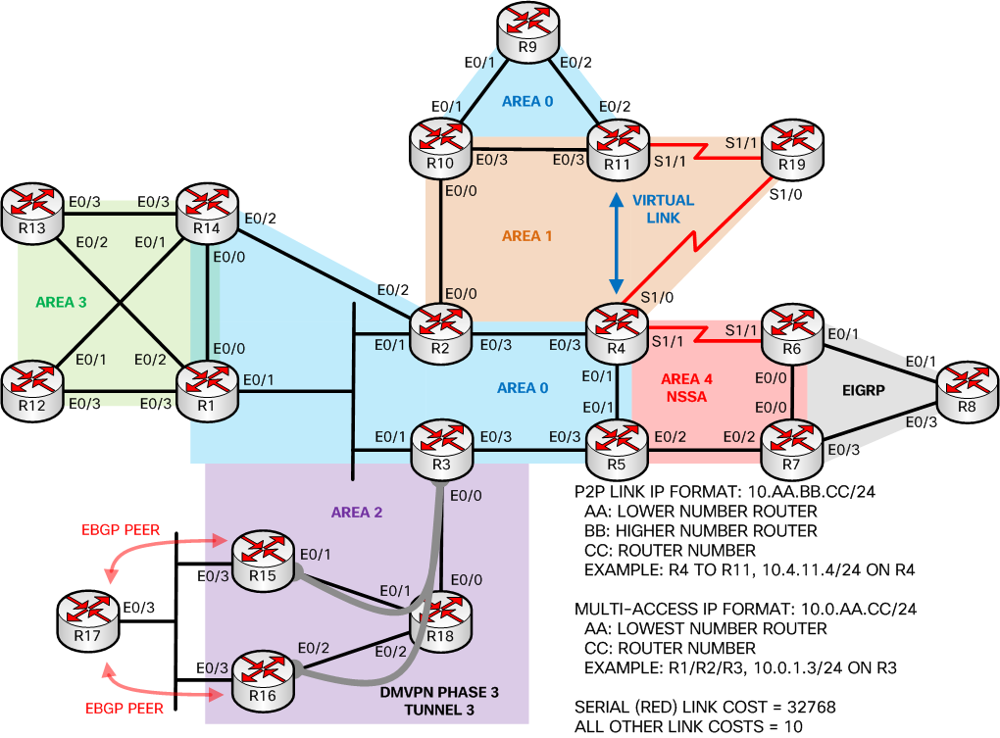

# EVE-NG FORK READ ME
Now you can enjoy Nick Russo's OSPF troubleshooting adventure without having to hook up everything yourself.

The EVE-NG file is _Exports_unetlab_export-20180728-234021.zip

That file has the initial configs only so you can get troubleshooting right away!
Just import that into EVE-NG and away you go, you might have to tweek some IOS version settings...
- Steinn

# Troubleshooting OSPF (BRKRST-3310)
Welcome to the Github repository for the lab demonstration!

> Contact information:\
> Email:    njrusmc@gmail.com\
> Twitter:  @nickrusso42518

## initial-configs
This folder contains configurations with issues to be resolved.
See the README.md file in that folder for details.

## final-configs
This folder contains configurations with no issues; it can be used to check
your work. See the README.md file in that folder for details.

## Reference material
All of my Cisco Live sessions are easily accessible through my personal website.
You can also find session comments which highlight my areas for improvement.

> http://njrusmc.net/conf/conf.html

## Reference topology
Please reference this diagram when reviewing this Cisco Live session.

